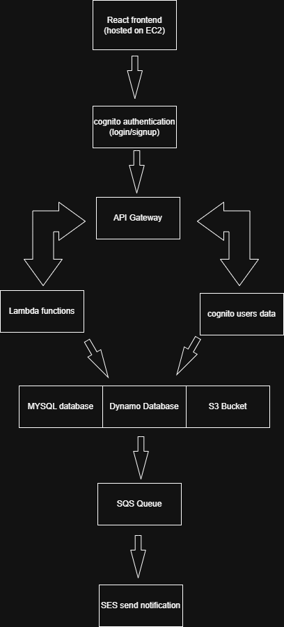

# AWS-Based Task Management System 📝☁️

## Overview

This is a full-stack **Task Management System** built with **React (frontend)** and a **serverless AWS architecture** on the backend. It enables authenticated users to create, manage, and track tasks with support for file attachments and asynchronous email notifications.

The system emphasizes scalability, fault tolerance, and real-world cloud architecture using key AWS services such as **Lambda**, **API Gateway**, **S3**, **RDS**, **SQS**, **SNS**, and **Cognito**.

---

## Features

### ✅ User Authentication
- AWS **Cognito** integration for sign-up, login, and JWT-based access control.

### 📋 Task Management
- Create, read, update, and delete tasks using a RESTful API.
- Each task includes title, description, due date, and optional attachments.

### 📎 File Upload
- Upload and view task-specific files (stored in **S3**).
- Attachments are tied to task and user IDs.

### 🔔 Email Notifications
- Notifications are sent via **SNS + SES** when a task is created, updated, or deleted.
- Emails are sent dynamically to the currently signed-in user.

### 📨 Asynchronous Messaging
- Uses **Amazon SQS** to decouple the task actions from the notification system.
- **Lambda** polls the SQS queue and triggers email notifications via SES.

### 🛡️ Secure Architecture
- IAM Roles and scoped policies limit access to each component.
- API Gateway secured using Cognito authorizer.

### 📊 Monitoring & Logging
- Logs and metrics monitored using **CloudWatch**.
- Lambda log groups and RDS monitoring enabled.
- Alarms set for EC2 CPU utilization.

---

## Architecture Diagram

 <!-- Replace with the actual image name in your repo -->

---

## Technologies Used

### Frontend
- React
- Tailwind CSS
- Hosted on EC2 with Nginx

### Backend / Cloud
- **API Gateway**
- **AWS Lambda (Node.js)**
- **Amazon RDS (MySQL)**
- **Amazon S3**
- **Amazon Cognito**
- **Amazon SQS**
- **Amazon SES**
- **IAM, VPC, CloudWatch**

---

## Deployment

### 1. Frontend
- Deployed on an EC2 instance (Amazon Linux 2023)
- Nginx configured to serve the React build
- React app fetches data from API Gateway secured with JWTs

### 2. Backend
- Serverless functions via Lambda
- REST API exposed through API Gateway
- MySQL database hosted in Amazon RDS
- File uploads handled via multipart/form-data to S3

---

